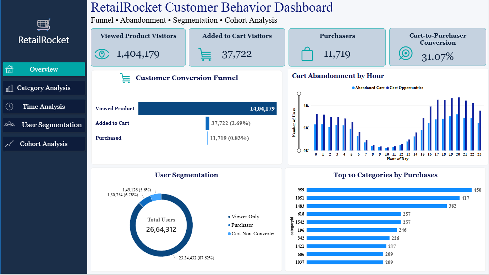
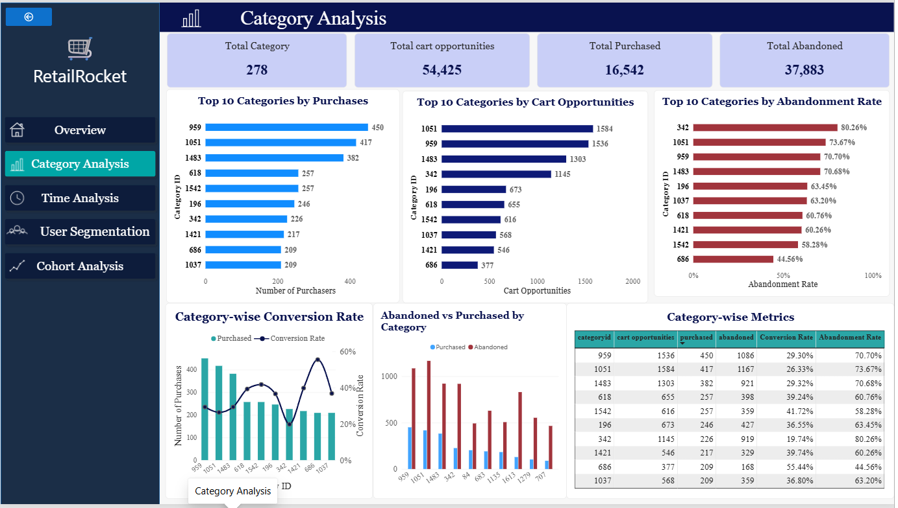
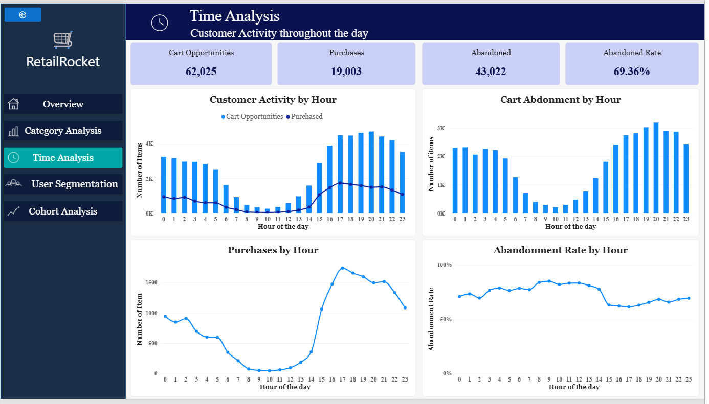
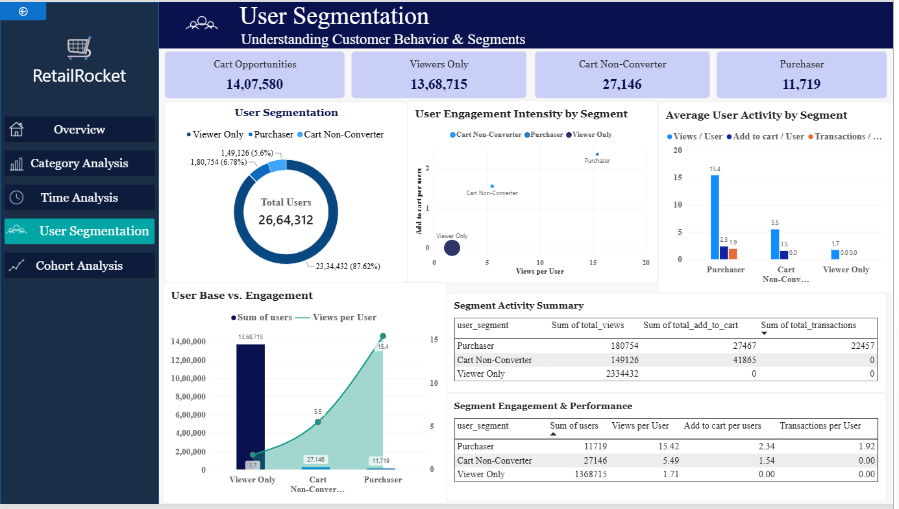
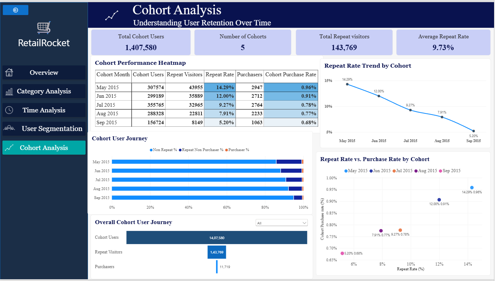

# RetailRocket Customer Behavior Analytics

## 📊 Project Overview

This project is an end-to-end **E-commerce Customer Behavior Analytics**
project developed using the **RetailRocket E-commerce Dataset**.

The project follows the complete data analytics workflow:

**Raw Data → Data Cleaning → Exploratory Data Analysis → SQL Analysis
→ Excel Analysis → Power BI Data Modeling → DAX → Interactive Dashboard → Business Insights**

The main objective was to understand how customers interact with products,
identify where users drop out of the purchasing journey, understand
customer segments, analyze category and time-based behavior, and study
repeat behavior through cohort analysis.

---

# 📂 Dataset Source

The dataset was obtained from the **RetailRocket E-commerce Dataset on Kaggle**.

**Dataset:** RetailRocket Recommender System Dataset

**Source:** Kaggle

**Link:** https://www.kaggle.com/retailrocket/ecommerce-dataset

The dataset contains anonymized real-world e-commerce behavioral data
collected over approximately **4.5 months**.

The dataset was originally created for research related to recommender
systems and implicit user feedback.

---

# 📦 Dataset Contents

The dataset contains four physical files:

### 1. events.csv

Contains customer interaction data.

The main event types are:

- `view` – customer viewed a product
- `addtocart` – customer added a product to the cart
- `transaction` – customer completed a purchase

### 2. item_properties_part1.csv

Contains product-level properties recorded over time.

### 3. item_properties_part2.csv

Contains the remaining product-property records.

### 4. category_tree.csv

Contains the hierarchical structure of product categories.

---

# 📈 Original Dataset Statistics

According to the Kaggle dataset description:

| Metric | Value |
|---|---:|
| Total Events | 2,756,101 |
| Unique Visitors | 1,407,580 |
| Product Views | 2,664,312 |
| Add-to-Cart Events | 69,332 |
| Transaction Events | 22,457 |
| Data Collection Period | Approximately 4.5 months |

The event data represents customer interactions with products through
viewing, adding products to the cart, and completing transactions.

---

# 🔄 Project Workflow

The project was completed through the following stages:

### Step 1 — Data Collection

Downloaded the RetailRocket E-commerce Dataset from Kaggle.

### Step 2 — Data Understanding

Examined:

- Dataset structure
- Number of rows and columns
- Data types
- Unique users
- Unique products
- Event types
- Missing values
- Duplicate records
- Category information
- Timestamp information

### Step 3 — Data Cleaning using Python

Python was used to prepare the raw data for analysis.

The cleaning process included:

- Loading the raw CSV files
- Inspecting the dataset structure
- Checking data types
- Checking missing values
- Identifying duplicate records
- Examining unique users and products
- Converting timestamps into usable date/time fields
- Creating derived variables required for analysis
- Preparing event-level data for further analysis

Libraries used included:

- Pandas

---

# 🔎 Exploratory Data Analysis using Python

After cleaning the data, Exploratory Data Analysis (EDA) was performed
to understand customer behavior.

The analysis examined:

- Distribution of event types
- Product views
- Add-to-cart activity
- Transactions
- User activity
- Product activity
- Customer interaction patterns
- Time-based customer behavior

EDA helped identify the major patterns that were later developed into
business-focused Power BI analyses.

---

# 🧮 SQL Analysis

SQL was used to perform structured business analysis on the cleaned
e-commerce data.

The analysis included:

- User-level analysis
- Event-level analysis
- Product-level analysis
- View activity
- Add-to-cart activity
- Transaction activity
- Conversion calculations
- Cart abandonment analysis
- Category-level analysis
- Customer behavior analysis

SQL was used to extract and aggregate the information required for
dashboard development.

---

# 📑 Excel Analysis

After performing data cleaning, transformation and exploratory data analysis
in Python, the required analyzed and summarized data was extracted from
Python and prepared in Excel.

The Excel file was created from the Python analysis rather than directly
using the complete raw dataset.

Excel was used for:

- Storing the processed analytical data
- Validating calculated metrics
- Reviewing summarized user-level and event-level results
- Supporting further analysis before dashboard development
- Preparing the data required for Power BI

This approach helped reduce the size of the data used for dashboard
development while retaining the information required for the business
analysis.

---

# 📊 Power BI Dashboard

The complete raw RetailRocket event dataset contains more than 2 million
records. Instead of importing the entire raw dataset directly into Power BI,
the data was first processed and analyzed using Python.

The required cleaned, transformed and summarized data was then extracted
from Python and prepared in Excel before being imported into Power BI.

This approach made the Power BI model more manageable while retaining the
information required for the dashboard analyses.

Power BI was used for:

- Data modeling
- KPI development
- DAX measures
- Interactive filtering
- Data visualization
- Dashboard development
- Business analysis

---

# 1️⃣ Overview

The Overview page provides a high-level summary of customer behavior.

### Key KPIs

- Viewed Product Visitors
- Added to Cart Visitors
- Purchasers
- Cart-to-Purchase Conversion

### Analysis

The page contains:

- Customer Conversion Funnel
- Cart Abandonment by Hour
- User Segmentation
- Top 10 Categories by Purchases

### Customer Conversion Funnel

The purchasing journey is represented as:

**Viewed Product → Added to Cart → Purchased**

This helps identify the drop-off between different stages of the
customer journey.

---

# 2️⃣ Category Analysis

The Category Analysis page examines customer behavior across product
categories.

The analysis includes:

- Purchases by category
- Cart opportunities by category
- Abandoned carts
- Category conversion rate
- Category abandonment rate
- Top categories by purchases

This analysis helps understand differences in customer behavior across
product categories.

---

# 3️⃣ Time Analysis

The Time Analysis page examines customer activity throughout the day.

The hourly analysis uses a **0–23 hour scale**.

### Visuals include:

- Customer Activity by Hour
- Cart Abandonment by Hour
- Purchases by Hour
- Abandonment Rate by Hour

### KPIs include:

- Cart Opportunities
- Purchases
- Abandoned Carts
- Abandonment Rate

This analysis helps identify changes in customer activity, purchasing and
cart abandonment across different hours of the day.

---

# 4️⃣ User Segmentation

Customers were divided into three behavioral segments:

### 👀 Viewer Only

Users who viewed products but did not add products to the cart or complete
a transaction.

### 🛒 Cart Non-Converter

Users who added products to the cart but did not complete a transaction.

### 🛍️ Purchaser

Users who completed at least one transaction.

### Segment Analysis

The analysis compares the segments using:

- Number of users
- Views per User
- Add-to-Cart per User
- Transactions per User
- Total Views
- Total Add-to-Cart
- Total Transactions

### Engagement Analysis

An **User Engagement Intensity by Segment** scatter plot was created to
compare:

- Views per User
- Add-to-Cart per User

The size of the bubbles represents the number of users in each segment.

This helps compare the intensity of customer engagement across the three
behavioral groups.

---

# 5️⃣ Cohort Analysis

Cohort analysis was performed to understand repeat customer behavior over
time.

Users were grouped according to their cohort month.

### Key KPIs

- Total Cohort Users
- Number of Cohorts
- Total Repeat Visitors
- Average Repeat Rate

### Cohort Performance

The analysis includes:

- Cohort Users
- Repeat Visitors
- Repeat Rate
- Purchasers
- Cohort Purchase Rate

A heatmap was used to make differences between cohorts easier to compare.

---

## 📈 Repeat Rate Trend

A line chart was created to show how the repeat rate changes across
different cohorts.

This helps identify differences in repeat visitor behavior between
cohort months.

---

## 📊 Repeat Rate vs Purchase Rate

A scatter plot was created to examine the relationship between:

- Repeat Rate
- Cohort Purchase Rate

Each point represents a cohort month.

---

## 🔄 Cohort User Journey

A 100% stacked visualization was created to show the composition of each
cohort based on:

- Non-Repeat Users
- Repeat Non-Purchasers
- Purchasers

This provides a normalized comparison of cohort composition.

---

## 🔻 Cohort User Journey Funnel

A funnel analysis was also created to show the overall movement from:

**Cohort Users → Repeat Visitors → Purchasers**

This provides an additional view of customer progression through the
repeat-purchase journey.

---

# 🧮 Power BI & DAX

Power BI was used for:

- Data modeling
- Relationships
- Calculated measures
- KPI development
- Interactive filtering
- Dashboard design
- Data visualization

DAX was used to create calculated metrics such as:

- User counts
- Views per User
- Add-to-Cart per User
- Transactions per User
- Conversion rates
- Abandonment rates
- Repeat rates
- Cohort purchase rates
- Funnel metrics

---

# 📌 Key Analytical Areas

The project covers the following major business analytics areas:

| Analysis | Purpose |
|---|---|
| Conversion Funnel | Understand customer movement from viewing to purchasing |
| Cart Abandonment | Identify users who do not complete purchases |
| Category Analysis | Compare customer behavior across categories |
| Time Analysis | Understand activity patterns across hours |
| User Segmentation | Group users according to behavioral patterns |
| Engagement Analysis | Compare intensity of user interactions |
| Cohort Analysis | Study repeat behavior over time |
| Retention Analysis | Examine repeat visitor behavior across cohorts |

---

# 🛠️ Tools & Technologies

### Programming & Analysis
- Python
- Pandas

### Database & Querying
- SQL

### Spreadsheet Analysis
- Microsoft Excel

### Business Intelligence
- Microsoft Power BI
- Power Query
- DAX

### Data Visualization
- Power BI

---

# 📁 Project Files

| File | Description |
|---|---|
| `Retail.ipynb` | Python data cleaning and exploratory data analysis |
| `Retail.sql` | SQL queries and business analysis |
| `Retail.pbix` | Interactive Power BI dashboard |
| `RetailRocket_PowerBI_Data.xlsx` | Excel analysis and supporting data |
| `Power BI Screenshots/` | Final Power BI dashboard screenshots |

---

# 🖼️ Dashboard Preview

## Overview

## Category Analysis

## Time Analysis

## User Segmentation

## Cohort Analysis

---

# 🎯 Skills Demonstrated

- Data Cleaning
- Data Wrangling
- Exploratory Data Analysis
- Python
- SQL
- Excel
- Power Query
- DAX
- Data Modeling
- KPI Development
- Dashboard Development
- Data Visualization
- Customer Funnel Analysis
- Conversion Analysis
- Cart Abandonment Analysis
- Category Analysis
- Time Series / Time-based Analysis
- User Segmentation
- Customer Engagement Analysis
- Cohort Analysis
- Retention Analysis
- Business Intelligence

---

# 💡 Project Outcome

This project demonstrates an end-to-end data analytics workflow, starting
from raw e-commerce event data and progressing through data cleaning,
exploratory analysis, SQL analysis, Excel-based validation and Power BI
dashboard development.

The final dashboard brings together multiple perspectives of customer
behavior, including:

**Acquisition/Views → Cart Activity → Conversion → Abandonment →
Segmentation → Repeat Behavior → Cohort Analysis**

The project demonstrates how raw transactional and behavioral data can be
transformed into an interactive business intelligence solution for
understanding customer behavior and purchasing patterns.

---
# 🔑 Key Takeaways

- A substantial drop-off was observed between product viewing and
  add-to-cart activity, with **1,404,179 viewed-product visitors** compared
  with **37,722 added-to-cart visitors**, resulting in a **2.69% view-to-cart
  conversion rate**.

- Of the **37,722 users who added products to their carts**, **11,719
  completed a purchase**, giving a **31.07% cart-to-purchase conversion rate**.

- **Viewer Only** users represented the largest user segment with
  **1,368,715 users**, followed by **Cart Non-Converters (27,146)** and
  **Purchasers (11,719)**.

- Purchasers showed higher engagement intensity than the other segments,
  with higher views per user and add-to-cart activity per user.

- Repeat visitor behavior differed across cohorts, with repeat rates ranging
  from **14.29% in May 2015 to 5.20% in September 2015** in the analyzed
  cohort table.

- Cohort purchase rates ranged from **0.68% to 0.96%** across the five
  analyzed cohorts.

- Customer activity varied throughout the day, with differences observed in
  viewing, cart activity and cart abandonment across different hours.

# 🚀 Areas for Improvement & Future Scope

- **Enhanced Cohort Analysis:** Compare cohorts by cohort age, such as
  Month 0, Month 1, Month 2 and Month 3, to make retention comparisons
  more meaningful.

- **Category-Level Insights:** Map category IDs to meaningful category
  names wherever the available category hierarchy supports it.

- **Deeper Funnel Analysis:** Analyze view-to-cart and cart-to-purchase
  conversion across categories and time periods.

- **Cart Abandonment Analysis:** Investigate product- and category-level
  abandonment patterns to identify where customers are most likely to
  leave the purchasing journey.

- **Customer-Level Analysis:** Extend the analysis to repeat purchase
  frequency, number of products purchased and time between interactions,
  where supported by the available data.

- **Predictive Analytics:** Develop machine-learning models to predict
  purchase probability or cart abandonment.

- **Dashboard Enhancement:** Add additional interactive filters and
  drill-through functionality for deeper exploration of customers,
  categories and time periods.

- **Automation:** Develop an automated data pipeline connecting the
  cleaned data to the Power BI dashboard for easier refresh and reporting.

## 👩‍💻 Author

**G. Janani**

M.Sc. Agricultural Statistics

Aspiring Data Analyst | Business Intelligence | Data Analytics
